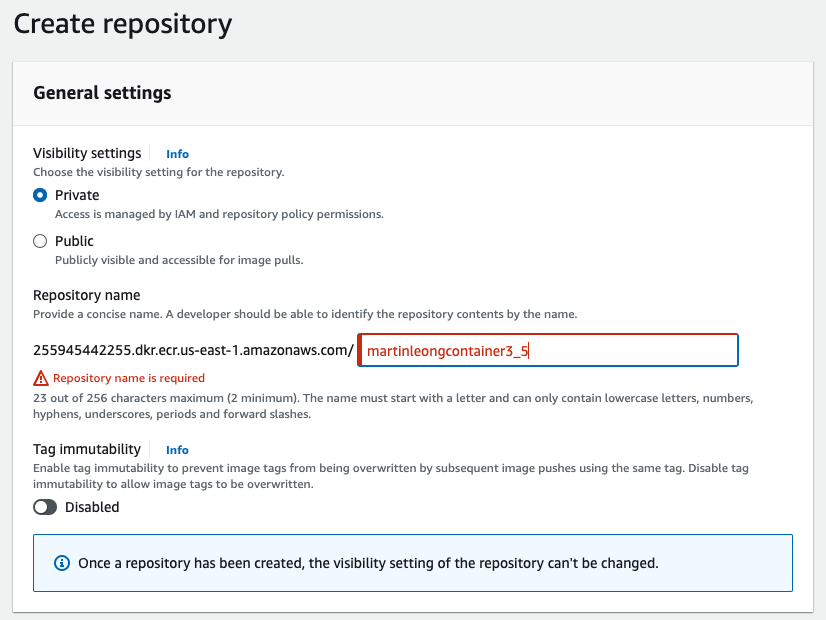
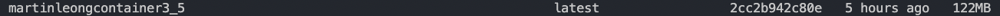
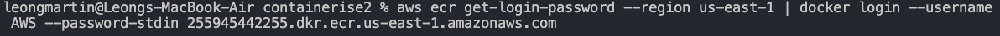
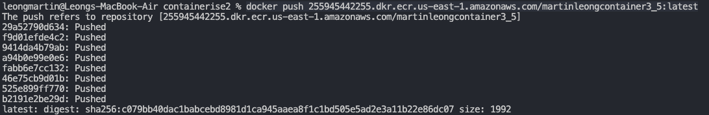

# Pushing a Node.js application to AWS ECR

## Overview
A hello-node application is pushed from the repository to AWS ECR named
"martinleongcontainer3_5". This repository contains the necessary files. 

To see the hello-node application is running, install the node package first:

```
npm install
```

Next, in type localhost:8080 in the browser to see the running node application.

## Create a (private) ECR in AWS console
In AWS console, search for ECR or Elastic Container Registry, Next, select the
button "Create repository" to visit the page as follows:
 


For our current purpose, we will set this repository as private. Fill in the name
of the repository, which in this case will be "martinleongcontainer3_5" and click
"Create repository" at the bottom of the page. 

## Create the Docker Image
To containerise the hello-node application locally, run the command below.

```docker build -t martinleongcontainer3_5 .```

The period (.) at the end allows the image to be build an image using the files 
from the current folder, and name it "martinleongcontainer3_5". 

To see if the image is saved in docker, run "docker images". 



## Pushing images to ECR
To push the image into AWS ECR using AWS CLI, run the following command to 
retrieve authentication token and authenticate your Docker client to your registry. 
Upon success, "Login Succeeded" will be displayed.

 

Next, tag the image so that you it can be to the issued ERC repository:

```
docker tag martinleongcontainer3_5:latest 255945442255.dkr.ecr.us-east-1.amazonaws.com/martinleongcontainer3_5:latest
```

Lastly, push the image to the ECR!

```
docker push 255945442255.dkr.ecr.us-east-1.amazonaws.com/martinleongcontainer3_5:latest
```

 